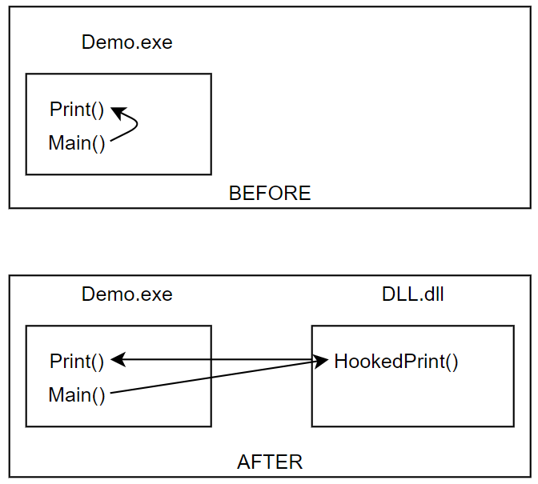
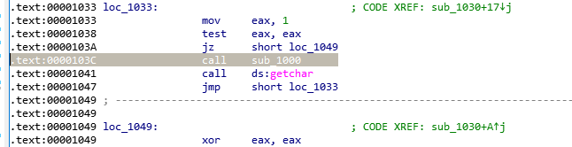
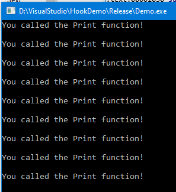
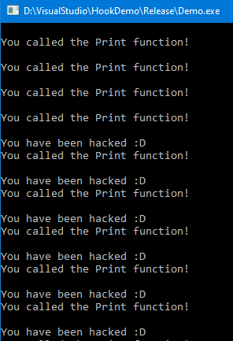
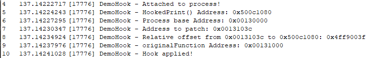

# HookDemo

Simple function hooking demo.

# Introduction

In this repository there is a simple example of function hooking.
The Demo application contains a function called `Print()`. A hook will be put to this function by injecting the dll called DLL.

# Finding the instruction to hook with IDA

# Without Hook

# With Hook

# Debug of the DLL

